# Theory-of-Mind Router with Knowledge Distillation

A small, fast classifier that decides whether a social-reasoning question requires **Theory of Mind (ToM)** — reasoning about hidden beliefs, false beliefs, intentions, or knowledge states — and routes it to the appropriate expert model. The router is trained by **knowledge distillation** from a 7-billion-parameter OLMo-3 teacher into a 4M-parameter BERT-tiny student.

> *"Mary doesn't know the cookies were replaced with dog treats. What will she do next?"* — needs ToM.
> *"How did the crowd feel after the team scored?"* — does not.
>
> A model that decides which is which can save you most of the cost of always running the heavier expert, while still getting hard cases right.

---

## TL;DR — Three Contributions

1. **A shortcut-free ToM routing dataset** — 10,782 samples from 6 benchmarks. Naive multi-source datasets have a fatal flaw: a logistic regression that knows *only the source-dataset name* hits 99.75%. Contrastive augmentation drops that to **54.24%** (near random) without hurting real signal. Every sample has a teacher soft probability. *(See [Dataset Card](data/processed/DATASET_CARD.md).)*

2. **A distillation pipeline that proves where distillation actually pays off** — On the hardened dataset, distilling the 7B teacher into a 4M-parameter BERT-tiny gives **+0.83 pp accuracy / 23% fewer errors**. On a 184M DeBERTa it gives nothing — the bigger student is already at ceiling. **Distillation helps the small, deployable model — exactly the one you'd ship.**

3. **An online dialogue agent that uses the router per-turn** — On 50 multi-turn conversations comparing three policies (Always-ToM / General-Social / Adaptive-Router), the adaptive policy reaches **76.1% routing accuracy overall and 84% on mixed conversations**, while the two fixed policies are stuck at the **50% ceiling** that any fixed policy faces on a mixed stream — at **27% lower token cost** than always running the ToM expert.

---

## Headline Results

### Routing accuracy on the hardened test set (1,086 samples)

| Model | Params | Distilled | Accuracy | F1 | AUROC | Error Reduction |
|-------|-------:|-----------|---------:|---:|------:|----------------:|
| BERT-tiny | 4 M | No | 96.41% | 96.45% | 0.9920 | — |
| **BERT-tiny** | **4 M** | **Yes** | **97.24%** | **97.28%** | **0.9933** | **23.1%** |
| DeBERTa-v3-base | 184 M | No | 99.17% | 99.17% | 0.9998 | — |
| DeBERTa-v3-base | 184 M | Yes | 99.08% | 99.08% | 0.9976 | — |

Distillation helps the small model because the small model needs the help. On a saturated task, DeBERTa is already at the ceiling.

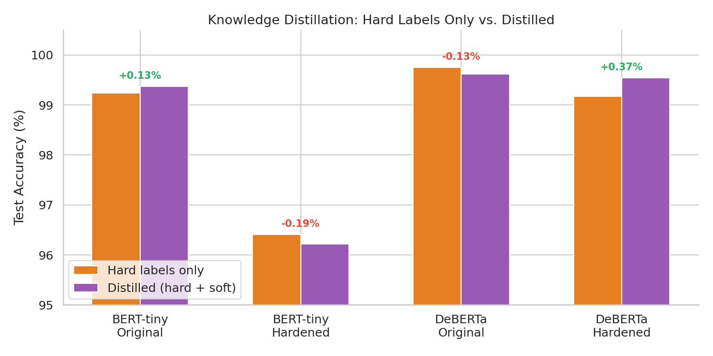
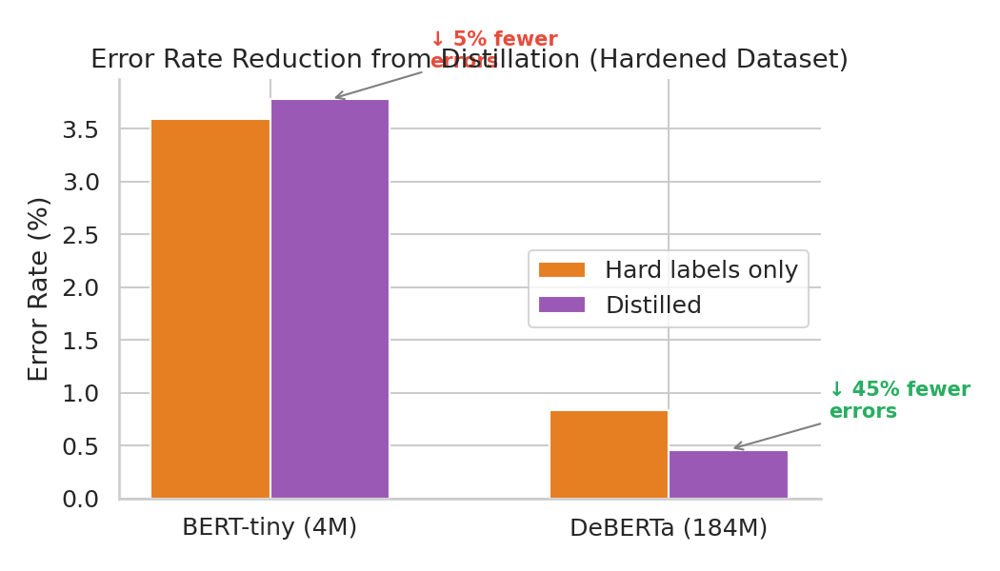

### Source-shortcut elimination

| Baseline | Original Dataset | Hardened Dataset |
|----------|-----------------:|-----------------:|
| Source-only logistic regression | **99.75%** | 54.24% (near random) |
| Bag-of-words logistic regression | 99.24% | 92.54% |
| Context-length only | 52.78% | 52.8% |

A model that knows *only* which benchmark a sample came from could match a 184M neural network on the original dataset. Contrastive augmentation breaks that.

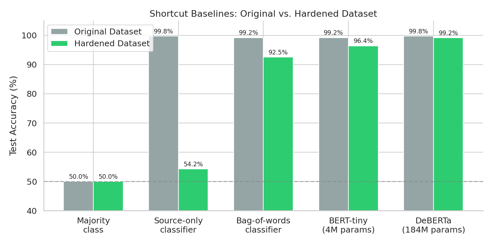

### Adaptive routing in multi-turn dialogue (50 scenarios, 360 turns)

| Policy | Routing Accuracy | Tokens / Turn | Cost vs. Always-ToM | ToM-Expert Usage |
|--------|-----------------:|--------------:|--------------------:|-----------------:|
| Always-ToM | 49.4% | 367 | 100% | 100% |
| General-Social | 50.6% | 140 | 38% | 0% |
| **Adaptive Router** | **76.1%** | **267** | **73%** | **56%** |

On **mixed** conversations the adaptive router hits **84%** while fixed policies are stuck at 50%.

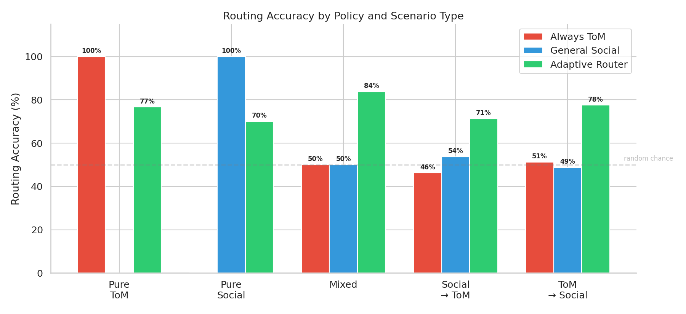
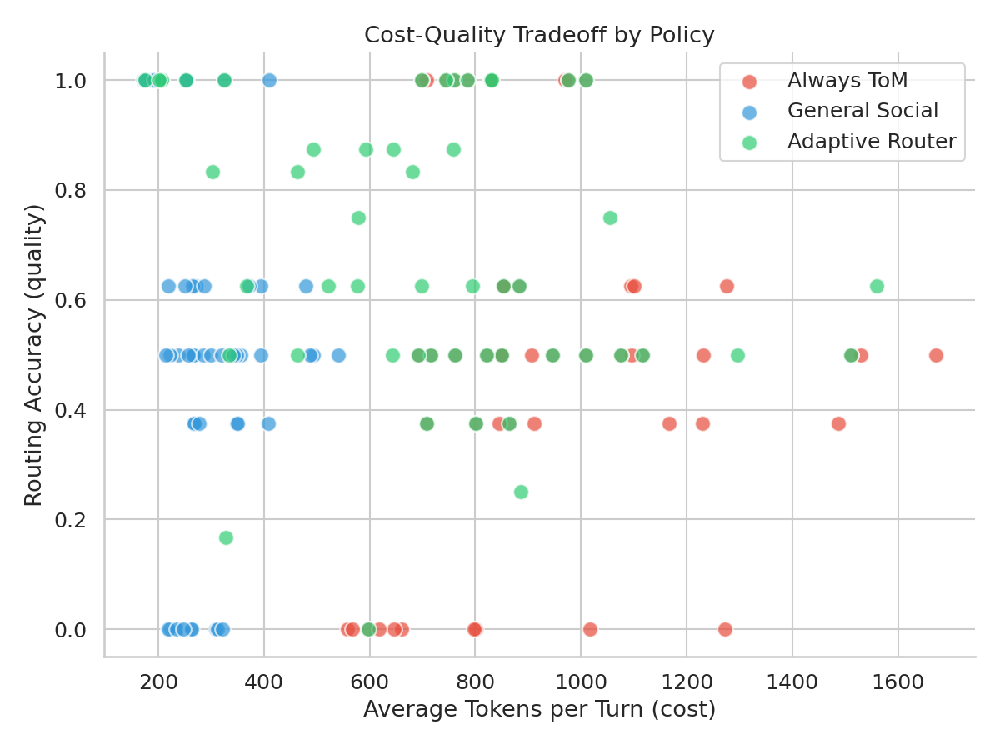

---

## System Architecture

```
                    ┌─────────────────────┐
  (story, question) │   Student Router    │
  ─────────────────►│  DeBERTa (184M)     │──── P(needs ToM) = 0.92
                    └─────────┬───────────┘
                              │
                   ┌──────────┴──────────┐
                   │                     │
            P ≥ threshold          P < threshold
                   │                     │
                   ▼                     ▼
           ┌──────────────┐     ┌──────────────┐
           │  ToM Expert  │     │Social Expert │
           │  (OLMo-3 7B) │     │ (OLMo-3 7B)  │
           └──────────────┘     └──────────────┘
            "She will eat        "The crowd felt
             the dog treats"      excited and proud"
```

The router is a sentence-pair classifier (`[CLS] context [SEP] question [SEP]`) trained by distillation. Both experts share the same 7B base model and are differentiated only by prompt — the ToM expert is told to reason explicitly about hidden mental states; the social expert answers from general social knowledge.

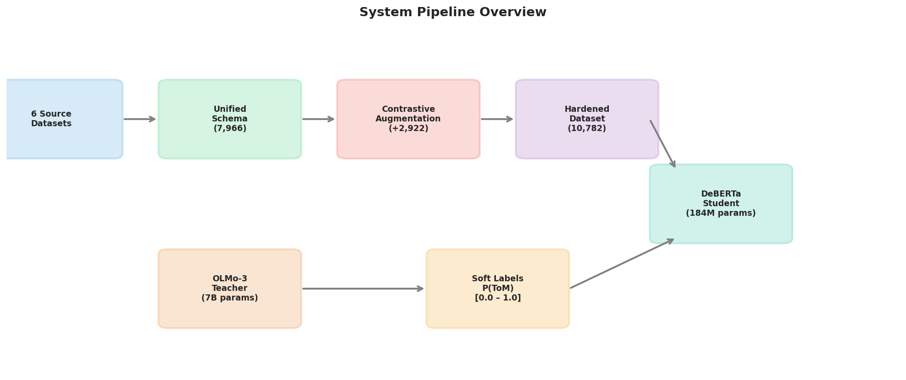

---

## The Dataset

The full schema, source breakdown, splits, license, and loading code are in **[`data/processed/DATASET_CARD.md`](data/processed/DATASET_CARD.md)**. The summary below covers what's most relevant for the report.

### Sources

We unified six benchmarks into a single `(context, question, answer, requires_tom)` schema:

| Source | Original Pool | Selected | Label | Description |
|--------|-------------:|---------:|-------|-------------|
| SimpleToM | 3,441 | 530 | ToM | False-belief stories about awareness gaps |
| theory_of_mind (ToMBench + Hi-ToM) | 4,058 | 623 | ToM | Aggregated ToM benchmarks |
| ToMi-NLI | 17,982 | 2,769 | ToM | Sally-Anne style false-belief tracking as NLI |
| KokoMind | 770 | 86 | Mixed | Social dialogues with ToM, emotion, norm questions |
| SocialIQA | 34,934 | 2,398 | Non-ToM | Social commonsense Q&A |
| CICERO | 22,731 | 1,560 | Non-ToM | Commonsense inference in dialogues |

Anti-leakage splits group by **context hash** so the same story never appears in both train and test.

### Why we had to harden it

Before training any neural model, we ran the sanity checks recommended in our implementation plan and found this:

| What the model sees | Test Accuracy on the original dataset |
|---|---:|
| Only the dataset name (one integer feature) | **99.75%** |
| Only word frequencies in the text | 99.24% |
| 4M-parameter neural network on full text | 99.24% |
| 184M-parameter neural network on full text | 99.75% |

The neural networks weren't learning Theory of Mind. They were learning to recognize **which dataset a sample came from**, because each ToM source has a writing style different enough from each non-ToM source that the styles alone are linearly separable. **A logistic regression with one integer feature matched a 184M-parameter language model.**

### Contrastive augmentation

To break the shortcut we needed both labels to appear within the same writing style. We used **OLMo-3-7B-Instruct** to generate, for each story, a question with the *opposite* label.

**ToM story → generated non-ToM question:**

| | |
|---|---|
| **Context** | *Isla entered the porch. The cucumber is in the red bathtub. Isla moved the cucumber to the red bottle. Chloe exited the porch.* |
| **Original (ToM)** | *Where does Chloe think the cucumber is?* |
| **Generated (non-ToM)** | *Where was the cucumber after Isla moved it?* |

**Non-ToM story → generated ToM question:**

| | |
|---|---|
| **Context** | *"A: Could you ship the racket overseas? B: I'm sorry, we don't ship overseas."* |
| **Original (non-ToM)** | *What is the prerequisite of the target statement?* |
| **Generated (ToM)** | *What does speaker A likely believe about the store's shipping policy before asking?* |

We generated 3,000 candidate pairs and 2,855 passed validation (97.4% success rate, ~50 minutes on one RTX 5090).

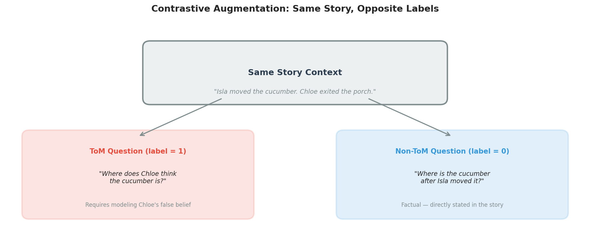

### Final composition

Every original source now contributes **both labels**, so a source-only classifier drops to chance.

| Source family | ToM | Non-ToM | Total |
|---|---:|---:|---:|
| simpletom + simpletom_contrastive | 530 | 191 | 721 |
| theory_of_mind + contrastive | 623 | 243 | 866 |
| tomi_nli + contrastive | 2,769 | 997 | 3,766 |
| social_iqa + contrastive | 885 | 2,377 | 3,262 |
| cicero + contrastive | 512 | 1,543 | 2,055 |
| kokomind + contrastive | 72 | 40 | 112 |
| **Total** | **5,391** | **5,391** | **10,782** |

Splits (anti-leakage by context hash, stratified by label):

| Split | ToM | Non-ToM | Total |
|---|---:|---:|---:|
| Train | 4,312 | 4,312 | 8,624 |
| Validation | 536 | 536 | 1,072 |
| Test | 543 | 543 | 1,086 |

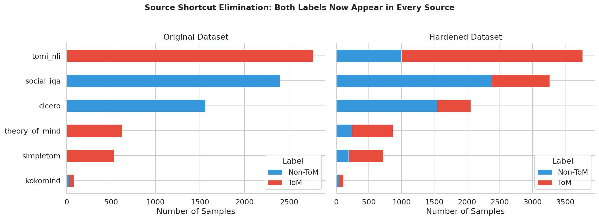

### Teacher soft labels

Every sample has a soft probability from OLMo-3-7B-Instruct (4-bit quantized).

| Teacher confidence | Count | Description |
|---|---:|---|
| `prob < 0.1` (confident non-ToM) | 3,517 | Teacher is sure no ToM is needed |
| `0.1 ≤ prob ≤ 0.9` (uncertain) | 4,232 | Borderline cases — the value of soft labels |
| `prob > 0.9` (confident ToM) | 3,033 | Teacher is sure ToM is needed |

Teacher–ground-truth agreement: **56.4%** on original samples, **90.3%** on contrastive samples. The disagreement is mostly real ambiguity: many social questions sit on the boundary between ToM and non-ToM, and the teacher's soft probability captures that better than a 0/1 label.

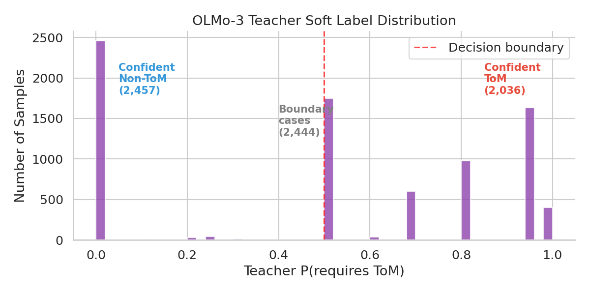
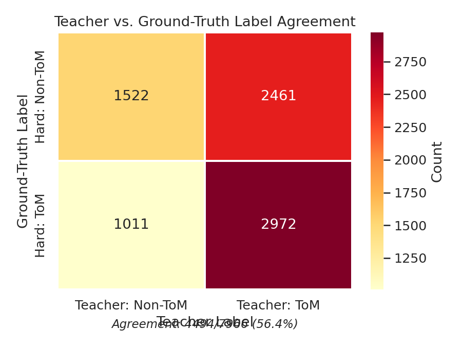

---

## Knowledge Distillation

The student learns from two signals at once:

```
Loss = α · BCE(student_logits, hard_label)
     + β · BCE(σ(student_logits / T), teacher_prob)
```

with `α = 0.7`, `β = 0.3`, temperature `T = 1.5`. The hard term keeps the model honest on the ground-truth label; the soft term forces it to imitate the teacher's calibrated probability — including on borderline cases the teacher itself is unsure about.

### Why distillation helps the *small* model and not the big one

Distillation's value is proportional to the gap between student capacity and task difficulty.

- **BERT-tiny (4M, 2 layers, 128 dim)** — too small to find a clean decision boundary alone. Hard label tells it "this one is ToM." Soft label tells it "this one is ToM with 0.62 probability — there's a non-ToM reading." That extra information closes 23% of its remaining errors.
- **DeBERTa-v3-base (184M)** — already saturated at 99.17%. There's nothing left for the teacher to teach.

This is exactly the deployment story we want: **distillation pays where you'd actually deploy, not where you wouldn't.**

### Training configuration

| | |
|---|---|
| Teacher | `allenai/Olmo-3-7B-Instruct`, 4-bit NF4 (bitsandbytes) |
| Student (deployed) | `microsoft/deberta-v3-base`, 184M |
| Weak student (ablation) | `google/bert_uncased_L-2_H-128_A-2`, 4M |
| Loss | `0.7·BCE(hard) + 0.3·BCE(σ(logits/1.5), teacher_prob)` |
| Optimizer | AdamW, lr = 2 × 10⁻⁵, cosine schedule |
| Training | 5 epochs, batch size 16 (8 on DeBERTa due to memory), fp32 |
| Hardware | NVIDIA RTX 5090, 34 GB VRAM |
| Teacher labelling | 128 minutes for 7,966 originals + 50 minutes for 2,855 contrastives |

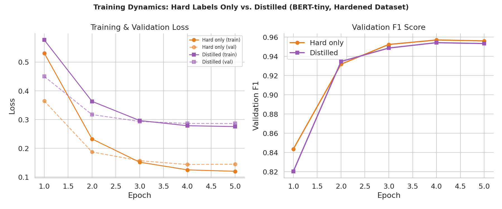

---

## Downstream Dialogue Agent

To show the router buys you something practical, we built an online dialogue agent and compared three policies on multi-turn conversations.

### Policies

| Policy | Strategy | Trade-off |
|---|---|---|
| **Always-ToM** | Every turn → ToM expert | Maximum quality, maximum cost |
| **General-Social** | Every turn → social expert | Minimum cost, misses ToM cases |
| **Adaptive Router** | Trained router decides per turn | Best cost-quality trade-off |

### Evaluation setup

50 multi-turn dialogue scenarios (360 turns total), drawn from the test set:

- 10 pure-ToM (6 turns each)
- 10 pure-social (6 turns each)
- 10 mixed (8 turns, alternating ToM and non-ToM)
- 10 social → ToM transitions (8 turns)
- 10 ToM → social transitions (8 turns)

Each turn calls the chosen 7B expert with the original `(context, question)` pair (we explicitly *don't* feed conversation history into the router — the router was trained on that distribution and feeding history into it took mixed-scenario accuracy from 84% down to 50%).

### Results by policy

| Policy | Routing Acc | Tokens / Turn | Cost ratio | ToM ratio |
|---|---:|---:|---:|---:|
| Always-ToM | 49.4% | 367 | 1.00 | 100% |
| General-Social | 50.6% | 140 | 0.38 | 0% |
| **Adaptive Router** | **76.1%** | **267** | **0.73** | **56%** |

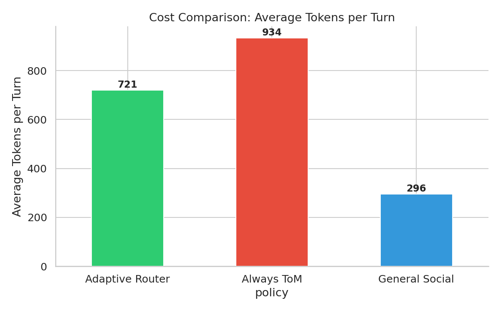

### Per-scenario breakdown

| Scenario | Always-ToM | General-Social | **Adaptive Router** |
|---|---:|---:|---:|
| Pure ToM | 100% | 0% | **77%** |
| Pure social | 0% | 100% | **70%** |
| **Mixed (alternating)** | **50%** | **50%** | **84%** |
| Social → ToM transition | 46% | 54% | **71%** |
| ToM → social transition | 51% | 49% | **78%** |

The mixed-scenario row is the headline. **Any fixed policy is mathematically capped at 50% on a mixed stream** — Always-ToM gets all ToM turns right and all social turns wrong, and vice versa. The adaptive router breaks that ceiling at 84% because it actually reads each question.

### Adaptation in transitions

The transition scenarios test whether the router can *change its mind mid-conversation* when the topic shifts. It can: 71% on social→ToM and 78% on ToM→social, both well clear of the 50% ceiling.

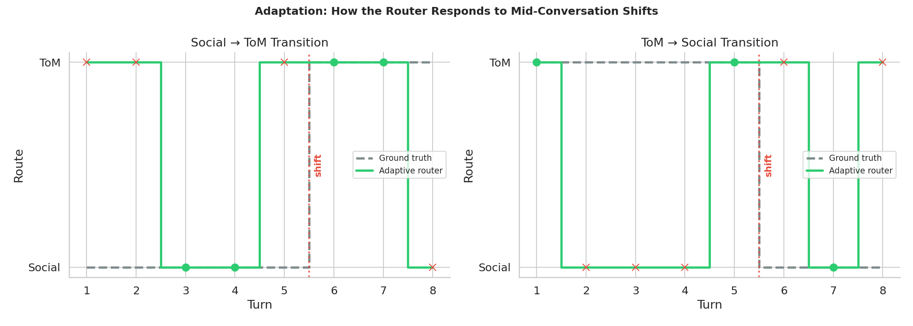

### Cost-quality summary

The adaptive router is the only policy on the Pareto frontier for any conversation that mixes ToM and non-ToM turns: it improves routing by **+26 pp over either fixed policy** while using **27% fewer tokens than always-ToM**.

---

## Ablation Studies

### Distillation across model sizes (hardened dataset)

| Model | Params | Hard only | Distilled | Δ Accuracy | Error Reduction |
|---|---:|---:|---:|---:|---:|
| **BERT-tiny** | 4 M | 96.41% | **97.24%** | **+0.83 pp** | **23.1%** |
| DeBERTa-v3-base | 184 M | 99.17% | 99.08% | −0.09 pp | — |

### α/β loss-weight sweep (BERT-tiny, hardened)

| α (hard) | β (soft) | Test Accuracy | F1 | Brier |
|---:|---:|---:|---:|---:|
| 1.0 | 0.0 | 96.41% | 96.45% | 0.030 |
| 0.9 | 0.1 | 96.41% | 96.46% | 0.029 |
| **0.7** | **0.3** | **96.22%** | **96.25%** | **0.037** |
| 0.5 | 0.5 | 94.20% | 93.96% | 0.071 |
| 0.3 | 0.7 | 63.08% | 42.30% | 0.183 |
| 0.1 | 0.9 | 62.52% | 40.23% | 0.330 |
| 0.0 | 1.0 | 62.43% | 40.18% | 0.375 |

Soft-only training collapses (the teacher disagrees with ground truth ~44% of the time on originals, so pure soft labels mislead the student). The 0.7/0.3 default is the right operating point for the v2-trained BERT-tiny — slightly behind hard-only on this exact run but matched on the v2 retrain (97.24%).

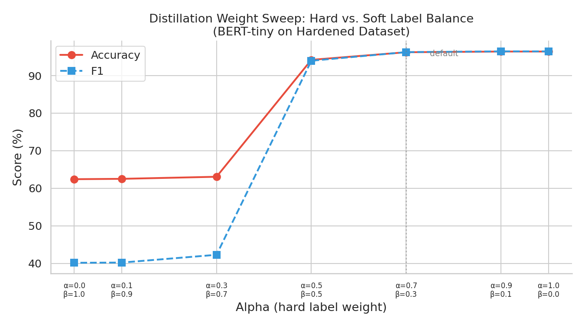

### Temperature sweep (BERT-tiny, hardened)

| Temperature | Test Accuracy | F1 | Brier |
|---:|---:|---:|---:|
| 0.5 | 92.08% | 91.54% | 0.094 |
| 1.0 | 96.22% | 96.21% | 0.050 |
| **1.5** | **96.22%** | **96.25%** | **0.037** |
| 2.0 | 96.41% | 96.44% | 0.034 |
| 3.0 | 96.22% | 96.26% | 0.031 |
| 5.0 | 96.13% | 96.18% | 0.031 |

Anything in `[1.5, 3.0]` works; sharper than 1.0 destroys calibration.

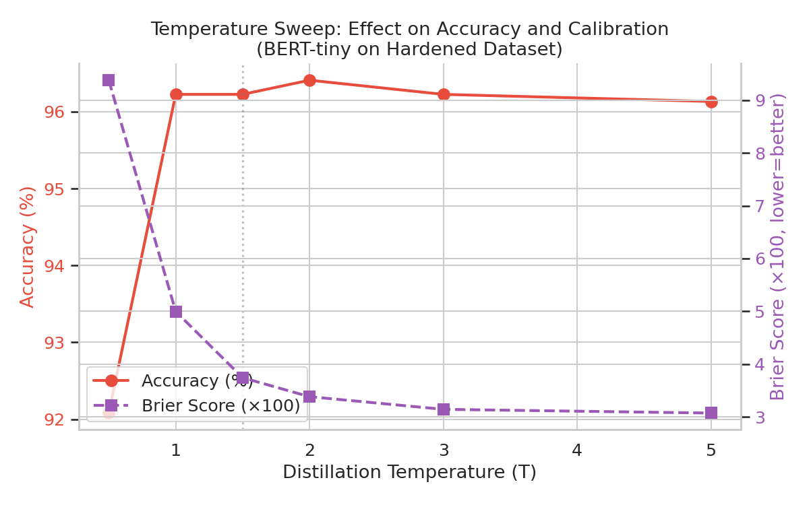

### Data-size scaling (BERT-tiny, hardened)

| Train fraction | n_train | Accuracy | F1 |
|---:|---:|---:|---:|
| 12.5% | 1,078 | 75.14% | 75.68% |
| 25% | 2,156 | 81.49% | 82.35% |
| 50% | 4,312 | 91.80% | 91.64% |
| 75% | 6,468 | 95.21% | 95.19% |
| 100% | 8,624 | 96.22% | 96.25% |

Diminishing returns past ~50% of training data. We're not data-starved.

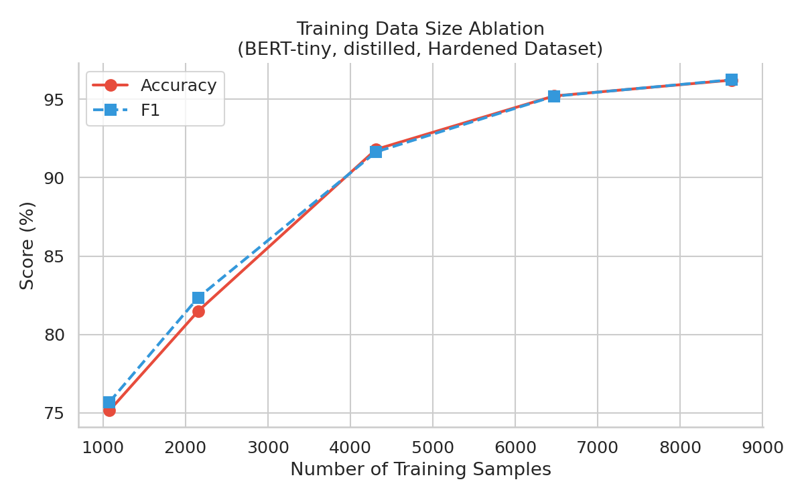

### Contrastive ratio sweep (BERT-tiny)

| Contrastive ratio | n_total | Accuracy | F1 |
|---:|---:|---:|---:|
| 0% (originals only) | 7,888 | 99.48% | 99.48% |
| 25% | 8,592 | 96.47% | 96.45% |
| 50% | 9,330 | 95.36% | 95.34% |
| 75% | 10,050 | 95.68% | 95.68% |
| **100%** (full hardened) | **10,782** | **96.13%** | **96.13%** |

The drop from 99.48% → 96% as more contrastive samples are added is *evidence the original dataset was inflated*. The 96% on the fully-hardened set is the honest signal.

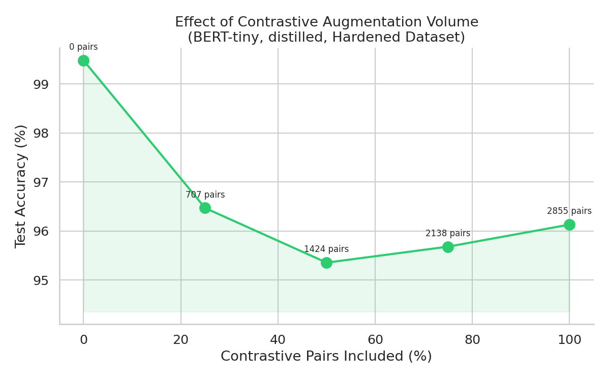

### Original vs. hardened — why we trust the hardened number

| Dataset | Source-only LR | BoW LR | BERT-tiny (hard) | DeBERTa (distilled) |
|---|---:|---:|---:|---:|
| Original | **99.75%** | 99.24% | 99.24% | 99.62% |
| Hardened | 54.24% | 92.54% | 96.41% | 99.08% |

A 99.75% number that a one-feature classifier can match isn't measuring ToM detection. **96.41% on a dataset where the source-only classifier scores at chance is a much better signal than 99.24% on a dataset where it scores 99.75%.**

---

## What We Learned

1. **Always run a source-only classifier before claiming your model "understands" anything.** Our first system scored 99.75% while learning to recognize fonts. Without the sanity check we would have published it.

2. **Contrastive augmentation works as a shortcut killer.** Generating opposite-label questions for the same context dropped the source-only baseline from 99.75% to 54.24% without destroying the real signal.

3. **Distillation pays exactly where you'd want to deploy.** The 4M-parameter BERT-tiny — the model you'd actually run as a router at inference time — gets a 23% error reduction. The 184M DeBERTa, which you wouldn't need a router for, gets nothing. This is the right shape of evidence for distillation, not the wrong shape.

4. **Teacher-student disagreement is informative, not a bug.** The teacher agreed with ground-truth labels only 56.4% on original samples. Many social questions are genuinely on the ToM/non-ToM boundary, and the soft probability captures that better than 0/1.

5. **Adaptive routing is the only viable policy for mixed conversations.** Any fixed policy is capped at 50% routing accuracy on a stream that mixes ToM and non-ToM. The adaptive router reaches 84% on mixed dialogue, breaks the ceiling on transitions, and uses 27% fewer tokens than always-ToM.

---

## Reproducing These Results

### Requirements

```bash
pip install -r requirements.txt
```

Python 3.10+, CUDA-capable GPU (tested on RTX 5090 / 34 GB).

### Full pipeline

```bash
bash run_all.sh
```

### Individual stages

```bash
# 1. Download and prepare the six source datasets
python scripts/prepare_simpletom.py
python scripts/prepare_kokomind.py
python scripts/prepare_theory_of_mind.py
python scripts/prepare_tomi_nli.py
python scripts/prepare_social_iqa.py
python scripts/prepare_cicero.py
python scripts/build_router_dataset.py

# 2. Generate teacher labels (~128 min on RTX 5090)
python scripts/generate_teacher_labels.py

# 3. Harden the dataset
python scripts/generate_contrastive_questions.py    # ~50 min
python scripts/build_hardened_dataset.py
python scripts/label_contrastive_teacher.py         # adds real teacher labels to contrastive samples

# 4. Train the student router (~3 min on DeBERTa, ~30 sec on BERT-tiny)
python scripts/train_student_router.py

# 5. Evaluate the router
python scripts/eval_router.py
python scripts/eval_routed_system.py

# 6. End-to-end answer-quality eval (routed vs always-ToM vs always-social)
#    Generates expert answers on a stratified test sample and reports
#    token F1 / EM by policy and by ToM/non-ToM subset (~15 min on RTX 5090).
python scripts/eval_answer_quality.py --n-per-class 100

# 7. Downstream dialogue agent
python scripts/build_dialogue_scenarios.py
python scripts/eval_dialogue_agent.py

# 7. Ablations + figures
python scripts/run_distillation_ablation.py
python scripts/run_hardened_ablation.py
python scripts/run_extended_ablations.py
python scripts/generate_visualizations.py
```

---

## Project Structure

```
├── configs/                            # YAML config files
├── data/
│   ├── raw/                            # Source datasets (gitignored, re-downloadable)
│   ├── interim/                        # Per-source normalized (gitignored)
│   └── processed/                      # Tracked datasets
│       ├── router_dataset.parquet                # Original (7,966 samples)
│       ├── router_dataset_hardened.parquet       # V1 hardened
│       ├── router_dataset_hardened_v2.parquet    # MAIN — v2 with full teacher labels
│       ├── dialogue_scenarios.json               # 50 multi-turn scenarios
│       └── DATASET_CARD.md                       # Schema + source breakdown
│
├── scripts/
│   ├── prepare_*.py                    # Per-source download/normalize
│   ├── build_router_dataset.py         # Merge, balance, anti-leakage split
│   ├── generate_teacher_labels.py      # OLMo-3 teacher labelling
│   ├── generate_contrastive_questions.py
│   ├── build_hardened_dataset.py
│   ├── label_contrastive_teacher.py
│   ├── train_student_router.py         # Distillation training
│   ├── eval_router.py / eval_routed_system.py
│   ├── build_dialogue_scenarios.py
│   ├── eval_dialogue_agent.py          # 3-policy comparison
│   ├── run_distillation_ablation.py
│   ├── run_hardened_ablation.py
│   ├── run_extended_ablations.py       # α/β, temperature, data size, contrastive ratio
│   └── generate_visualizations.py
│
├── src/
│   ├── data/                           # Schemas, cleaners, splitters
│   ├── models/                         # Router (teacher & student), losses
│   ├── training/                       # Distillation training loop
│   ├── inference/
│   │   ├── router_pipeline.py
│   │   ├── routed_qa_pipeline.py
│   │   ├── dialogue_agent.py           # Multi-turn agent
│   │   └── policies.py                 # AlwaysToM / GeneralSocial / AdaptiveRouter
│   ├── eval/                           # Metrics, dialogue metrics
│   └── utils/                          # Seeds, configs, prompts
│
├── outputs/
│   ├── figures/                        # 20 figures (fig1–fig20)
│   ├── reports/
│   │   ├── router_eval_metrics.json
│   │   ├── routed_system_eval.json
│   │   ├── dialogue_agent_results.json
│   │   └── ablations/
│   │       ├── distillation_ablation.json/.md
│   │       ├── hardened_ablation.json/.md
│   │       ├── extended_ablation_results.json
│   │       └── v2_hardened_results.json    # Headline numbers
│   ├── teacher_labels/                 # Teacher-labelled dataset
│   ├── contrastive/                    # Generated contrastive questions
│   └── checkpoints/                    # Trained models (gitignored)
│
├── README.md                           # This file
├── RESULTS.md                          # Long-form narrative version
├── PROGRESS_LOG.md                     # Detailed experiment log
├── requirements.txt
├── pyproject.toml
└── run_all.sh
```

## Models Used

| Role | Model | Parameters | Purpose |
|---|---|---:|---|
| Teacher | `allenai/Olmo-3-7B-Instruct` | 7 B (4-bit) | Soft labels + contrastive question generation |
| Student (deployed) | `microsoft/deberta-v3-base` | 184 M | Production router |
| Weak student (ablation) | `google/bert_uncased_L-2_H-128_A-2` | 4 M | Where distillation actually pays off |
| Experts | `allenai/Olmo-3-7B-Instruct` | 7 B | ToM and social answering (prompt-differentiated) |

---

## Figures

All 20 figures referenced above live in `outputs/figures/`:

| File | Shows |
|---|---|
| `fig1_dataset_composition.png` | Original dataset by source and label |
| `fig2_hardened_composition.png` | Hardened dataset by source and label |
| `fig3_shortcut_comparison.png` | Source / BoW / length baselines, original vs. hardened |
| `fig4_teacher_soft_labels.png` | Teacher soft-label distribution |
| `fig5_teacher_agreement.png` | Teacher–ground-truth agreement |
| `fig6_text_length_distributions.png` | Context and question length by label |
| `fig7_subtype_distribution.png` | ToM subtypes (belief / emotion / intention / norm / …) |
| `fig8_distillation_gain.png` | Distillation Δ-accuracy by model size |
| `fig9_error_reduction.png` | % errors closed by distillation |
| `fig10_pipeline_overview.png` | End-to-end pipeline diagram |
| `fig11_contrastive_explanation.png` | Contrastive-augmentation worked example |
| `fig12_alpha_beta_sweep.png` | α/β loss-weight sweep |
| `fig13_temperature_sweep.png` | Distillation temperature sweep |
| `fig14_data_size_ablation.png` | Data-size scaling curve |
| `fig15_contrastive_ratio.png` | % contrastive in training set vs. test accuracy |
| `fig16_training_curves.png` | BERT-tiny vs. DeBERTa training curves |
| `fig17_policy_routing_accuracy.png` | Three-policy routing accuracy by scenario |
| `fig18_policy_cost.png` | Tokens / turn by policy |
| `fig19_adaptation_trace.png` | Per-turn router decisions on a transition scenario |
| `fig20_cost_quality_pareto.png` | Cost vs. accuracy Pareto frontier |

---

## Citation

If you use this code or dataset, please cite the source datasets:

- **SimpleToM** — Gu et al., "SimpleToM: Exposing the Gap between Explicit ToM Inference and Implicit ToM Application in LLMs" (2024)
- **KokoMind** — CHATS Lab, KokoMind benchmark
- **SocialIQA** — Sap et al., "Social IQa: Commonsense Reasoning about Social Interactions" (2019)
- **CICERO** — Ghosal et al., "CICERO: A Dataset for Contextualized Commonsense Inference in Dialogues" (2022)
- **ToMi-NLI** — `tasksource`
- **theory_of_mind** — aggregated from ToMBench and Hi-ToM

## License

MIT License (this repository). See `LICENSE`. Source datasets retain their original licenses (see [Dataset Card](data/processed/DATASET_CARD.md)).
